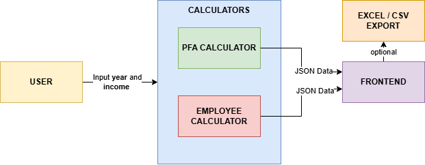
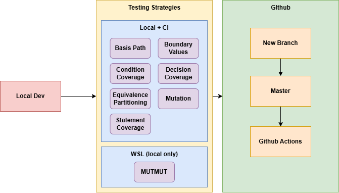

# TaxVision RO

## Table of Contents
- [Purpose of the Application](#purpose-of-the-application)
- [Project Resources](#project-resources)
- [Project Setup](#project-setup)
- [Continuous Integration (CI)](#continuous-integration-ci)
- [Technical Report](#technical-report)
  - [Testing Scope](#testing-scope)
  - [Testing Strategies](#testing-strategies)
  - [Tax Rules Configuration Structure (`src/tax_rules.json`)](#tax-rules-configuration-structure-srctax_rulesjson)
  - [Environment and Execution](#environment-and-execution)
  - [Technologies](#technologies)
    - [Streamlit vs Django](#streamlit-vs-django)
    - [Pytest vs Unittest](#pytest-vs-unittest)
- [Diagrams](#diagrams)
  - [Use case](#use-case-application-flow)
  - [Pipeline](#development-and-testing-pipeline)
- [AI-Assisted Testing Report](#ai-assisted-testing-report)

## Purpose of the Application
TaxVision RO helps users analyze Romanian income tax outcomes through a clear comparison workflow and practical decision support.

Primary objectives:
- Provide a clear history of comparisons so users can track and review previous simulations.
- Export calculation results to Excel and CSV for reporting and further analysis.
- Offer graphical views of results to make differences easier to interpret.

## Project Resources
### Presentation
- Presentation file: `TBD`

### Demo
- Application demo video: `TBD`
- Test execution results: `TBD`

## Project Setup
### Prerequisites
- Python 3.10 or newer
- `pip`
- `WSL` for mutation testing
- Optional: a Python virtual environment (`venv`)

### 1) Install dependencies
From the project root:

```bash
pip install -r requirements.txt
```

### 2) Run the application (Streamlit)
From the project root:

```bash
streamlit run src/app.py
```

After startup, Streamlit opens in the browser automatically (or use the URL shown in the terminal).

### 3) Run tests (pytest)
From the project root:

```bash
pytest
```

Verbose output:

```bash
pytest -v
```

### 4) Tool versions

## Continuous Integration (CI)

When this repository is hosted on GitHub, [`.github/workflows/ci.yml`](.github/workflows/ci.yml) runs only on **push to `master`** (for example after a pull request is merged). It does not run on other branches or on pull request events alone.

- **What runs:** `pytest` only (the full test suite under `tests/`).
- **What does not run:** mutation testing (`mutmut`) is **not** executed in CI.
  
## Technical Report

### Testing Scope
The testing scope includes mainly the business-logic layer:
- `calculator_pfa` (derived from `calculator_base`)
- `calculator_employee` (derived from `calculator_base`)
- `run_simulation(venit_brut, anul_fiscal, user_triggered)` - helper function used to run the simulation and update the session state.

Excluded from testing scope:
- Frontend/display concerns
- Streamlit presentation/UI behavior

### Testing Strategies
The implemented testing strategies are covered through dedicated test modules.

#### Basis path
Tests all linearly independent paths through the control flow graph, ensuring every unique execution sequence is covered. Paths were identified by mapping the source code logic into CFGs and ensuring each test case introduces at least one new edge. The core calculation logic (e.g., `_get_cas_base`) has a Cyclomatic Complexity of **V(G) = 3** because it contains 2 decision nodes ($V(G) = P + 1$), requiring exactly 3 independent paths for complete coverage.

- [CFG: CAS Base Calculation](diagrams/cfg_cas_base_test.png)
- [CFG: Tax Config Retrieval](diagrams/cfg_tax_config_base_test.png)
- [CFG: Initialization Validation](diagrams/cfg_init_validation_base_test.png)
- [CFG: Project Basis Path](diagrams/cfg_PFACalculator.png)
#### Boundary value
#### Condition coverage
Validates that each individual condition in compound boolean expressions evaluates to both True and False independently.
#### Decision coverage
Ensures that every branch of every decision point (e.g., if/else blocks) is executed at least once.
#### Equivalence partitioning
#### Statement coverage
#### Mutation testing

### Tax Rules Configuration Structure (`src/tax_rules.json`)
The fiscal configuration file is organized by year and contains all rule parameters needed by the calculation layer.

Structure overview:
- Top-level object keys are fiscal years (for example, `2023`, `2024`, `2025`).
- Each year contains:
  - `minimum_wage` - yearly minimum wage value used as the reference for thresholds and contribution bases.
  - `employee` - tax and contribution rules applied by the Employee calculator flow.
  - `pfa` - tax, thresholds, and bracket rules applied by the PFA calculator flow.

Inside `employee`:
- `cas_rate` - the current-year CAS contribution rate applied to employee gross income.
- `cass_rate` - the current-year CASS contribution rate applied to employee gross income.
- `income_tax_rate` - the current-year income tax rate applied after contribution deductions.

Inside `pfa`:
- `expense_ratio` - the deductible expense ratio used to estimate net taxable income from gross income.
- `cas_rate` - the current-year CAS rate used for PFA social contribution calculation.
- `income_tax_rate` - the current-year income tax rate applied to PFA taxable income.
- `cas_thresholds` - yearly threshold and base-multiplier rules used to determine CAS calculation base.
- `cass_rate` - the current-year CASS rate applied to the CASS base selected from brackets.
- `cass_brackets` - ordered income brackets that select the CASS base multiplier for the current year.

Bracket semantics:
- `max_income_multiplier` defines the upper interval limit as a multiple of minimum wage.
- `base_multiplier` defines the base used for CASS computation in that bracket.
- `max_income_multiplier: null` marks the final open-ended bracket.

### Environment and Execution
We ran everything directly on Windows (no virtual machine).
- Regular test execution was done on Windows.
- Mutation testing with `mutmut` was run through WSL.

### Technologies

#### Streamlit vs Django
Streamlit was chosen because we wanted to focus on tax logic and testing, not on building full web infrastructure.
- With Streamlit, we could quickly build the interface we needed (inputs, comparison metrics, charts, export actions) and iterate fast.
- Django is great for larger web platforms, but here it would have added extra layers (models, routing, templates, admin) that were outside our project goal.
- In short, Streamlit let us keep the project lightweight and spend more time on correctness and test coverage.

#### Pytest vs Unittest
The most important tooling decision in this project was using `pytest` instead of `unittest`.
- `pytest` made the test suite easier to write and read, especially because we organized tests by strategy (basis path, boundary value, condition, decision, equivalence, statement, mutation).
- We relied on `pytest` assertions and structure to keep tests concise while still expressing business rules clearly.
- Compared to `unittest`, we got the same verification power with less boilerplate, which helped us scale the suite faster.
- `pytest` also fit naturally with our mutation-testing workflow and with the way we structured this repository.

Our conclusion: `unittest` is solid, but `pytest` matched our goals better for speed, readability, and maintainability.

## Diagrams


### Use case (application flow)

High-level flow from user input through calculators to the frontend and optional export.



### Development and testing pipeline

Local development, testing strategies, and GitHub flow through Actions on `master`.



## AI-Assisted Testing Report


### Tools and roles

| Tool | Role |
|------|------|
| **Google Gemini** | Early brainstorming about the application idea and how to apply testing strategies. |
| **Gemini and Cursor** | Drafting and refining automated tests (`pytest`), including structure, assertions, and edge cases aligned with `src/` calculators and `src/tax_rules.json`. |
| **Cursor (feedback loop)** | After a full test module was written, we used the chat to cross-check coverage—for example, by walking through `TestEquivalencePartitioning` in `tests/test_equivalence_partitioning.py` to confirm invalid/valid partitions for `venit_brut` and `anul_fiscal` were represented and that both `EmployeeCalculator` and `PFACalculator` stayed in sync. |
| **Cursor** | Building and iterating the Streamlit UI in `src/app.py` (layout, inputs, comparison flow, exports) while keeping business logic in calculators and tests separate from presentation. |

### Workflow example

In **`tests/test_boundary_values.py`** we first wrote **employee** boundary cases by hand, then used this prompt to add **PFA** to the same tests: “Here is `test_venit_brut_boundary_zero` for `EmployeeCalculator` only. Add matching `PFACalculator` calls and assertions in the same test, same year, without changing pytest style.”

```19:40:tests/test_boundary_values.py
    def test_venit_brut_boundary_negative(self):
        """Boundary: just below zero (invalid)"""
        with pytest.raises(ValueError):
            EmployeeCalculator(-0.01, 2024)
        with pytest.raises(ValueError):
            PFACalculator(-0.01, 2024)

    def test_venit_brut_boundary_zero(self):
        """Boundary: exactly zero"""
        employee = EmployeeCalculator(0, 2024).calculate()
        assert employee["venit_net"] == 0.0

        pfa = PFACalculator(0, 2024).calculate()
        assert pfa["venit_net"] == 0.0

    def test_venit_brut_boundary_just_above_zero(self):
        """Boundary: just above zero"""
        employee = EmployeeCalculator(0.01, 2024).calculate()
        assert employee["venit_net"] > 0

        pfa = PFACalculator(0.01, 2024).calculate()
        assert pfa["venit_net"] > 0
```

### Example of prompts used


**Streamlit UI (Cursor)**

- **Prompt:** “Add a sidebar fiscal year selector and wire it to both calculators without moving tax math out of `src/` calculators.”

**Coverage review (Cursor)**

- **Prompt:** In `tests/test_equivalence_partitioning.py`, list every equivalence class we claim in the docstring and show which test method covers it for employee vs PFA. Flag gaps.

**Mutation testing with mutmut (Cursor / Gemini)**

- **Prompt:** “We run mutation testing with mutmut on the calculator code under `src/`. Walk through how to install and run it (`mutmut run`, then `mutmut results` / `mutmut show <id>` if needed). Then break down the report: how many mutants, killed vs survived vs no tests, what those buckets mean for our repo, a few interesting survivors, and which look equivalent vs worth a new test.”

### Limitations and how we used AI safely

- AI suggestions were always checked against **`src/tax_rules.json`** and running **`pytest`**; incorrect rates or thresholds were caught by tests or manual spot checks.
- We treated AI output as **draft code**: naming, imports, and assertions were aligned with the rest of the repo before merging.

### Summary

Gemini helped frame the problem and test matrix; Gemini and Cursor accelerated writing and extending suites such as **`tests/test_boundary_values.py`** and **`tests/test_equivalence_partitioning.py`**; Cursor closed the loop on coverage and delivered the Streamlit front end.
