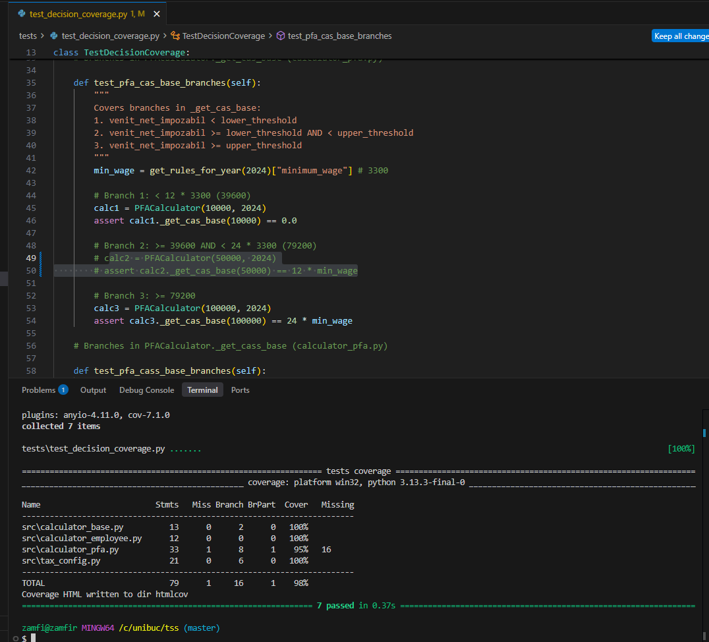
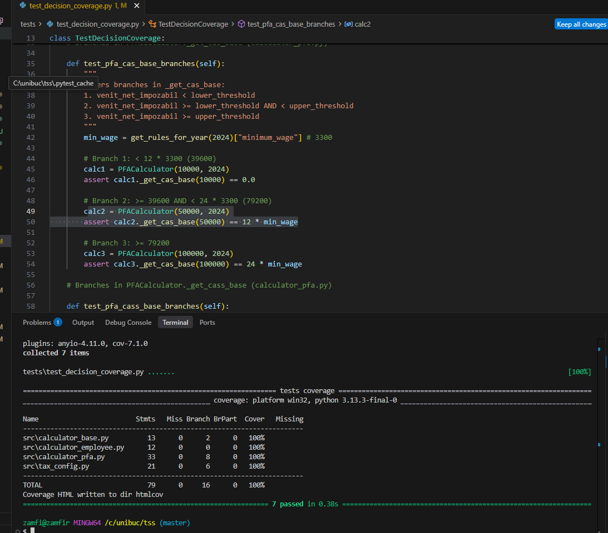
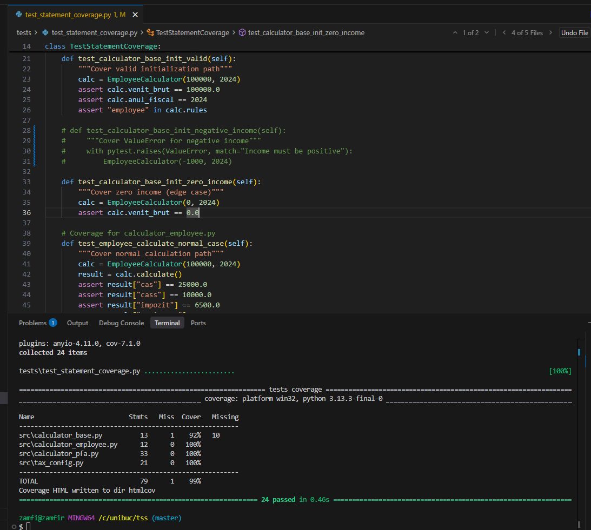
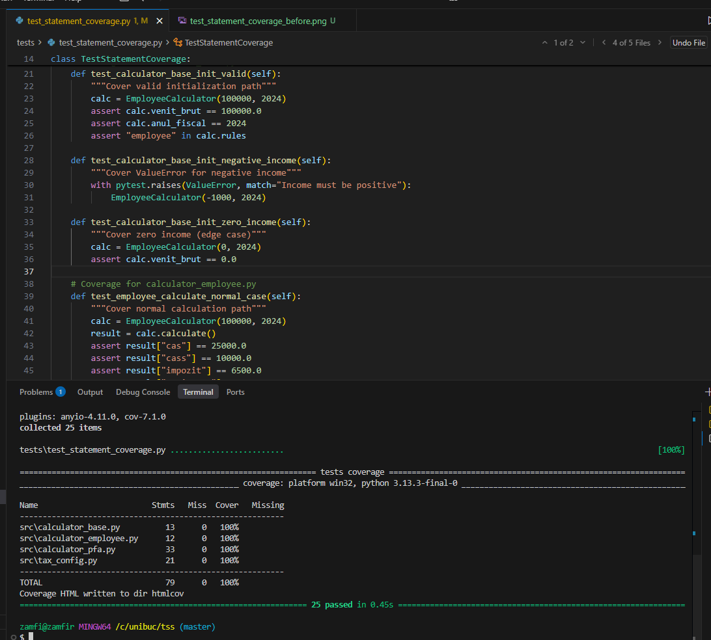
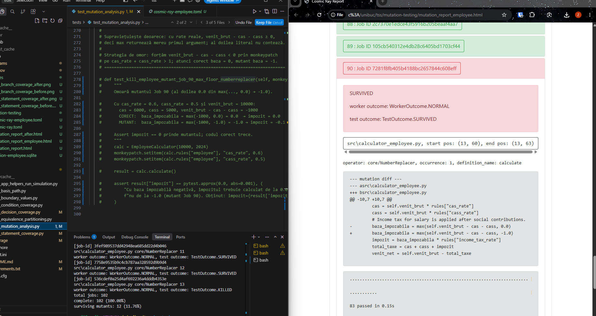
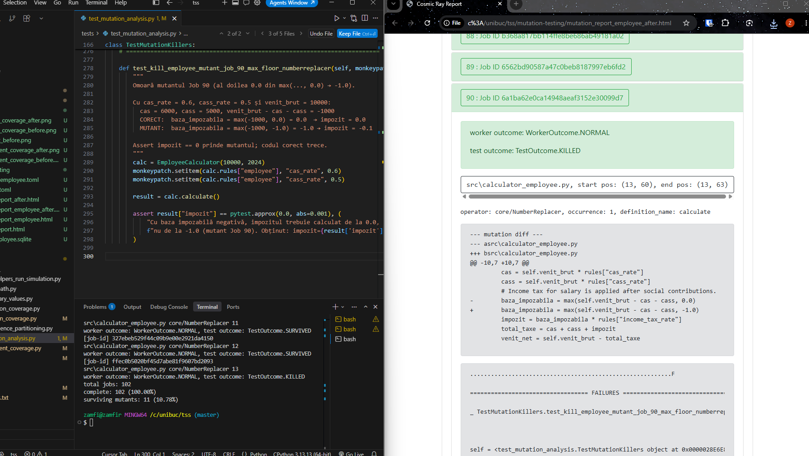

# TaxVision RO

Theme: T1 - Testare Unitară în Python

Team (18): Dragomir Miruna, Iștoc Simona, Tanislav Alexia, Zamfir Alexandru

## Table of Contents

- [Purpose of the Application](#purpose-of-the-application)
- [Project Resources](#project-resources)
- [Project Setup](#project-setup)
- [Continuous Integration (CI)](#continuous-integration-ci)
- [Technical Report](#technical-report)
  - [Testing Scope](#testing-scope)
  - [Testing Strategies](#testing-strategies)
    - [Equivalence partitioning](#equivalence-partitioning)
    - [Boundary value analysis](#boundary-value-analysis)
    - [Basis path and CFG](#basis-path)
  - [Tax Rules Configuration Structure (`src/tax_rules.json`)](#tax-rules-configuration-structure-srctax_rulesjson)
  - [Environment and Execution](#environment-and-execution)
  - [Technologies](#technologies)
    - [Streamlit vs Django](#streamlit-vs-django)
    - [Pytest vs Unittest](#pytest-vs-unittest)
- [Diagrams](#diagrams)
  - [Use case](#use-case-application-flow)
  - [Pipeline](#development-and-testing-pipeline)
- [AI-Assisted Testing Report](#ai-assisted-testing-report)
- [Bibliography](#bibliography)

## Purpose of the Application

TaxVision RO helps users analyze Romanian income tax outcomes through a clear comparison workflow and practical decision support.

Primary objectives:

- Provide a clear history of comparisons so users can track and review previous simulations.
- Export calculation results to Excel and CSV for reporting and further analysis.
- Offer graphical views of results to make differences easier to interpret.

## Project Resources

### Presentation

- Presentation file: `[demo/presentation.pdf](demo/presentation.pdf)` (repository file) · [Canva design](https://www.canva.com/design/DAHJYUPBviA/Xnno8TYtvOPjwEWKrLb4UA/edit)

### Demo

- Application demo video: `[demo/demo.mp4](demo/demo.mp4)` (repository file) · [https://youtu.be/Z5GPYjhroMY](https://youtu.be/Z5GPYjhroMY)
- Test execution results: `[demo/test_results.png](demo/test_results.png)`

## Project Setup

### Prerequisites

- Python 3.10 or newer
- `pip`
- Optional: a Python virtual environment (`venv`)

### 1) Install dependencies

From the project root:

```bash
pip install -r requirements.txt
```

### 2) Run the application (Streamlit)

From the project root (see [[1]](#bibliography) for Streamlit documentation):

```bash
streamlit run src/app.py
```

After startup, Streamlit opens in the browser automatically (or use the URL shown in the terminal).

### 3) Run tests (pytest)

From the project root (see [[2]](#bibliography) for pytest documentation):

```bash
pytest
```

Verbose output:

```bash
pytest -v
```

### 4) Mutation testing (cosmic-ray)

Mutation testing uses [cosmic-ray](https://cosmic-ray.readthedocs.io/) [[4]](#bibliography) on **local Windows** only. It is **not** run in GitHub Actions. Config, session databases, and HTML reports live under [`mutation-testing/`](mutation-testing/). Run all commands from the **project root**.

**PFA** - [`mutation-testing/cosmic-ray.toml`](mutation-testing/cosmic-ray.toml):

```bash
cosmic-ray init mutation-testing/cosmic-ray.toml mutation-testing/session.sqlite
cosmic-ray exec mutation-testing/cosmic-ray.toml mutation-testing/session.sqlite
cr-report mutation-testing/session.sqlite
PYTHONIOENCODING=utf-8 cr-html mutation-testing/session.sqlite > mutation-testing/mutation_report.html
```

**Employee** - [`mutation-testing/cosmic-ray-employee.toml`](mutation-testing/cosmic-ray-employee.toml):

```bash
cosmic-ray init mutation-testing/cosmic-ray-employee.toml mutation-testing/session-employee.sqlite
cosmic-ray exec mutation-testing/cosmic-ray-employee.toml mutation-testing/session-employee.sqlite
cr-report mutation-testing/session-employee.sqlite
PYTHONIOENCODING=utf-8 cr-html mutation-testing/session-employee.sqlite > mutation-testing/mutation_report_employee.html
```

In **cmd.exe**, replace the `cr-html` line with e.g. `set PYTHONIOENCODING=utf-8 && cr-html mutation-testing/session.sqlite > mutation-testing/mutation_report.html`.

Combined PFA + Employee metrics are summarized under **Mutation testing** in the [Technical report](#technical-report) below.

### 5) Tool versions


| Package (`requirements.txt`) | PyPI / pip name | Version |
| ---------------------------- | --------------- | ------- |
| streamlit                    | streamlit       | 1.55.0  |
| pandas                       | pandas          | 2.3.0   |
| openpyxl                     | openpyxl        | 3.1.5   |
| pytest                       | pytest          | 9.0.2   |
| pytest-cov                   | pytest-cov      | 7.1.0   |
| cosmic-ray                   | cosmic-ray      | 8.4.6   |


## Continuous Integration (CI)

When this repository is hosted on GitHub, `[.github/workflows/ci.yml](.github/workflows/ci.yml)` runs only on **push to `master`** (for example after a pull request is merged). It does not run on other branches or on pull request events alone. The workflow follows GitHub Actions conventions [[7]](#bibliography).

- **What runs:** `pytest` only (the full test suite under `tests/`).
- **What does not run:** mutation testing (`cosmic-ray`) is **not** executed in CI.

## Technical Report

### Testing Scope

The testing scope includes mainly the business-logic layer:

- `calculator_pfa` (derived from `calculator_base`)
- `calculator_employee` (derived from `calculator_base`)
- `run_simulation(venit_brut, anul_fiscal, user_triggered)` - helper function used to run the simulation and update the session state.

Excluded from testing scope:

- Frontend/display concerns
- Streamlit presentation/UI behavior

### Testing Strategies

The implemented testing strategies are covered through dedicated test modules. Equivalence partitioning, boundary value analysis, and basis-path testing follow standard unit-testing practice; project tools and external references are listed in the [Bibliography](#bibliography).

#### Basis path

Tests all linearly independent paths through the control flow graph, ensuring every unique execution sequence is covered. Paths were identified by mapping the source code logic into CFGs and ensuring each test case introduces at least one new edge. The core calculation logic (`_get_cas_base`) has a Cyclomatic Complexity of **V(G) = 3** because it contains 2 decision nodes (*V(G) = P + 1*), requiring exactly 3 independent paths for complete coverage. Tests live in `[tests/test_basis_path.py](tests/test_basis_path.py)`.

**Control Flow Graph- `PFACalculator._get_cas_base`**


Source reference:

```7:17:src/calculator_pfa.py
    def _get_cas_base(self, venit_net_impozabil: float) -> float:
        # CAS base changes with thresholds expressed in minimum wages.
        cas_rules = self.rules["pfa"]["cas_thresholds"]
        lower_threshold = cas_rules["lower_multiplier"] * self.minimum_wage
        upper_threshold = cas_rules["upper_multiplier"] * self.minimum_wage

        if venit_net_impozabil < lower_threshold:
            return 0.0
        if venit_net_impozabil < upper_threshold:
            return cas_rules["lower_base_multiplier"] * self.minimum_wage
        return cas_rules["upper_base_multiplier"] * self.minimum_wage
```


| CFG node                       | Code section                                                            |
| ------------------------------ | ----------------------------------------------------------------------- |
| **Start: `_get_cas_base`**     | Function entry; compute `lower_threshold` and `upper_threshold`         |
| `**income < lower_threshold**` | First decision (`if venit_net_impozabil < lower_threshold`)             |
| **Return `0.0`**               | True branch of first decision- no CAS base                              |
| `**income < upper_threshold**` | False branch of first decision; second decision                         |
| **Return `lower_base`**        | True branch of second decision- `lower_base_multiplier × minimum_wage`  |
| **Return `upper_base`**        | False branch of second decision- `upper_base_multiplier × minimum_wage` |
| **End**                        | Merge point after all returns                                           |


There are no loops in this function; control flows sequentially through at most two decisions.

`[tests/test_basis_path.py](tests/test_basis_path.py)` covers each CFG branch of `_get_cas_base`:


| CFG branch                                                                                   | Test method                               |
| -------------------------------------------------------------------------------------------- | ----------------------------------------- |
| `income < lower_threshold` → True → Return `0.0`                                             | `test_cas_base_path_1_below_lower`        |
| `income < lower_threshold` → False; `income < upper_threshold` → True → Return `lower_base`  | `test_cas_base_path_2_between_thresholds` |
| `income < lower_threshold` → False; `income < upper_threshold` → False → Return `upper_base` | `test_cas_base_path_3_above_upper`        |


Additional CFG diagrams for other analyzed functions:

- [CFG: Tax Config Retrieval](diagrams/cfg_tax_config_base_test.png)
- [CFG: Initialization Validation](diagrams/cfg_init_validation_base_test.png)
- [CFG: Project Basis Path](diagrams/cfg_PFACalculator.png)

#### Condition coverage

Validates that each individual condition in compound boolean expressions evaluates to both True and False independently.

#### Decision coverage

Ensures that every branch of every decision point (e.g., if/else blocks) is executed at least once. Tests live in [`tests/test_decision_coverage.py`](tests/test_decision_coverage.py), including monkeypatched cases for `if not years` in `get_rules_for_year` and the post-loop `return 0.0` in `_get_cass_base`.

**Coverage impact** - with `test_get_rules_for_year_no_years_configured` and `test_pfa_cass_base_empty_brackets_fallback` removed, branch coverage drops on `tax_config.py` (line 32) and `calculator_pfa.py` (lines 22, 26); with the full suite it returns to 100%:

| Before (tests removed) | After (full suite) |
|------------------------|-------------------|
|  |  |

Generate a **branch coverage** report with `pytest-cov` [[2]](#bibliography) [[3]](#bibliography) (`--cov-branch`):

```bash
pytest tests/test_decision_coverage.py \
  --cov=calculator_pfa \
  --cov=calculator_employee \
  --cov=calculator_base \
  --cov=tax_config \
  --cov-branch \
  --cov-report=term-missing \
  --cov-report=html:htmlcov
```

The terminal output lists `Branch` and `BrPart` columns; open `htmlcov/index.html` for the HTML report.

#### Equivalence partitioning

Divides the input domain into classes of equivalent behavior and tests representative values from each class. This reduces redundant tests while ensuring that both valid and invalid partitions for `venit_brut` and `anul_fiscal` are covered. All cases below are in `[tests/test_equivalence_partitioning.py](tests/test_equivalence_partitioning.py)`.


| Input         | Invalid classes                                                                          | Valid classes                                                                                                                    |
| ------------- | ---------------------------------------------------------------------------------------- | -------------------------------------------------------------------------------------------------------------------------------- |
| `venit_brut`  | Negative values (`venit_brut < 0`) → `ValueError`                                        | Zero (`venit_brut = 0`); small positive (below PFA CAS lower threshold for 2024); large positive (above all configured brackets) |
| `anul_fiscal` | Non-integer strings; integer strictly before `min(get_available_years())` → `ValueError` | Exact configured years; future years → fallback to latest rules                                                                  |


**PFA-specific classes (2024).** With `expense_ratio = 0.0`, taxable income equals `venit_brut`. CAS uses strict `<` at `12 × 3300` and `24 × 3300`; CASS brackets use `<=` at `6×`, `12×`, `24×`, and `60×` minimum wage (see `[src/tax_rules.json](src/tax_rules.json)`).


| Class                      | Representative (`venit_brut`) | Test method                         | Expected `cas` / `cass` |
| -------------------------- | ----------------------------- | ----------------------------------- | ----------------------- |
| Below CAS lower threshold  | `30 000`                      | `test_pfa_income_thresholds_low`    | `cas = 0.0`             |
| Between CAS thresholds     | `60 000`                      | `test_pfa_income_thresholds_medium` | `cas = 9 900.0`         |
| Above CAS upper threshold  | `150 000`                     | `test_pfa_income_thresholds_high`   | `cas = 19 800.0`        |
| One value per CASS bracket | `10 000` … `300 000`          | `test_pfa_cass_brackets`            | `cass` per bracket base |


#### Boundary value analysis

Focuses on values at the edges of input domains and transitions between equivalence classes. We test values just below, exactly at, and just above thresholds where tax behavior can change. Tests live in `[tests/test_boundary_values.py](tests/test_boundary_values.py)`.

**Boundaries covered:**

1. **Sign of `venit_brut`:** `-0.01` (invalid), `0`, `0.01`
2. **Configured fiscal years:** `min_year − 1`, `min_year`, `min_year + 1`, `max_year − 1`, `max_year`, `max_year + 1`
3. **PFA CAS thresholds (2024):** `lower_threshold` and `upper_threshold`

**CAS threshold boundary cases (2024)**


| Test case   | `venit_brut`             | Position                  | Expected `cas`                  | Test method                                       |
| ----------- | ------------------------ | ------------------------- | ------------------------------- | ------------------------------------------------- |
| Below lower | `39 599` (`12×3300 − 1`) | just under lower boundary | `0.0`                           | `test_pfa_cas_boundary_lower_threshold_minus_one` |
| On lower    | `39 600` (`12×3300`)     | exactly at lower boundary | `9 900.0`                       | `test_pfa_cas_boundary_lower_threshold`           |
| Above lower | `39 601` (`12×3300 + 1`) | just over lower boundary  | `9 900.0`                       | `test_pfa_cas_boundary_lower_threshold_plus_one`  |
| Below upper | `79 199` (`24×3300 − 1`) | just under upper boundary | `9 900.0` (still lower bracket) | `test_pfa_cas_boundary_upper_threshold_minus_one` |
| On upper    | `79 200` (`24×3300`)     | exactly at upper boundary | `19 800.0`                      | `test_pfa_cas_boundary_upper_threshold`           |
| Above upper | `79 201` (`24×3300 + 1`) | just over upper boundary  | `19 800.0`                      | `test_pfa_cas_boundary_upper_threshold_plus_one`  |


The code uses strict less-than (`<`) at both CAS decision points, so income exactly at `lower_threshold` uses the middle bracket and income exactly at `upper_threshold` uses the upper bracket.

#### Statement coverage

Measures whether each executable statement in the code has been executed by the test suite at least once. It is used here to confirm that the main tax calculation paths and configuration lookups are actually exercised by tests. Tests live in [`tests/test_statement_coverage.py`](tests/test_statement_coverage.py), including monkeypatched cases for `if not years` in `get_rules_for_year` (`tax_config.py`) and the post-loop `return 0.0` in `_get_cass_base` (`calculator_pfa.py`).

**Coverage impact** - with `test_get_rules_for_year_no_years_configured` and `test_pfa_get_cass_base_empty_brackets_fallback` removed, statement coverage misses `tax_config.py` line 32 and `calculator_pfa.py` line 26; with the full suite both files reach 100%:

| Before (tests removed) | After (full suite) |
|------------------------|-------------------|
|  |  |

Generate a **statement (line) coverage** report with `pytest-cov` [[2]](#bibliography) [[3]](#bibliography):

```bash
pytest tests/test_statement_coverage.py \
  --cov=calculator_pfa \
  --cov=calculator_employee \
  --cov=calculator_base \
  --cov=tax_config \
  --cov-report=term-missing \
  --cov-report=html:htmlcov
```

Example report: [`htmlcov/index.html`](htmlcov/index.html) (Coverage.py [[3]](#bibliography), via `pytest-cov`).

#### Mutation testing

**Mutation testing analysis - cosmic-ray report**

Mutant generator: **cosmic-ray**. Scope: **PFA + Employee** business logic (`src/calculator_pfa.py`, `src/calculator_employee.py`). Metrics below **aggregate** two runs: [`mutation-testing/cosmic-ray.toml`](mutation-testing/cosmic-ray.toml) on PFA (229 jobs) and [`mutation-testing/cosmic-ray-employee.toml`](mutation-testing/cosmic-ray-employee.toml) on Employee (102 jobs), **331 jobs** total. HTML examples: [`mutation-testing/mutation_report_after.html`](mutation-testing/mutation_report_after.html) (PFA), [`mutation-testing/mutation_report_employee.html`](mutation-testing/mutation_report_employee.html) / [`mutation-testing/mutation_report_employee_after.html`](mutation-testing/mutation_report_employee_after.html) (Employee).

**Configuration** (under [`mutation-testing/`](mutation-testing/))

- PFA: `cosmic-ray.toml` - `module-path`: `src/calculator_pfa.py`
- Employee: `cosmic-ray-employee.toml` - `module-path`: `src/calculator_employee.py`
- `test-command` (both): `python -X utf8 -m pytest tests/ -x -q` (UTF-8 mode avoids Cosmic Ray decoding errors on Windows)

**Overall results (PFA + Employee combined)**

Before:  


| Metric                         | Value         |
| ------------------------------ | ------------- |
| Total mutants generated (jobs) | 331           |
| Mutants executed to completion | 331 (100%)    |
| Mutants killed                 | 297 (~89.73%) |
| Surviving mutants              | 34 (~10.27%)  |


After:


| Metric                         | Value         |
| ------------------------------ | ------------- |
| Total mutants generated (jobs) | 331           |
| Mutants executed to completion | 331 (100%)    |
| Mutants killed                 | 301 (~90.94%) |
| Surviving mutants              | 30 (~9.06%)   |


**How to read the cosmic-ray HTML report**

- **Green** - mutant killed (tests fail on mutated code - desired).
- **Red** - mutant survived (tests still pass on mutated code - suite weakness).
- **Blue** - no coverage (no test reaches that line).

**Example mutation operators**

- `core/NumberReplacer` - replaces numeric literals (e.g. `0.0` → `1.0`, `2` → `3`).
- `core/ReplaceBinaryOperator_Sub_Add` / `Add_Sub` / `Add_Mul` / `Add_Div` / `Sub_Mul` / `Mul_Pow` / `Mul_BitXor` - replaces arithmetic operators (e.g. `-` with `+`).
- `core/ReplaceOrWithAnd` - `or` → `and`.
- `core/AddNot` - inserts `not` (e.g. `if x` → `if not x`).
- `core/ReplaceComparisonOperator_Is_IsNot`, `ReplaceComparisonOperator_Lt_Is` - replaces comparison operators.

---

**Analysis of surviving mutants**

**Equivalent mutants (relative to current test data)**

Across **both calculators**, the largest share of survivors are `**NumberReplacer`** mutations that stay **observationally equivalent** with the incomes and amounts used in the suite.

- **PFA (`calculator_pfa.py`):** bracket multipliers (e.g. `6` → `7` in `max_income_multiplier`) and `round(..., 2)` → a different decimal count (e.g. `round(cas, 2)` → `round(cas, 3)`): tests rarely sit exactly on bracket edges, and many test values are whole RON amounts, so nudging a multiplier or the `round` precision often leaves returned floats unchanged (see the PFA report, e.g. a band such as `NumberReplacer` occurrences 2–24 with 19 survivors in the 229-job PFA run).
- **Employee (`calculator_employee.py`):** in the employee-only report, jobs **91–101** replace the `2` in `round(x, 2)` for each field of the `calculate()` result dict with another small integer; gross and contribution lines in tests behave as whole numbers, so those mutations do not change observable outputs- same “rounding equivalence” idea as on PFA.

**Non-equivalent mutants selected for killing**

1. **Job 23 - `ReplaceBinaryOperator_Sub_Add` in `calculate()`**
  - **File:** `src/calculator_pfa.py`, line 34.  
  - **Mutation:** `venit_net_impozabil = max(self.venit_brut - cheltuieli, 0.0)` → `venit_net_impozabil = max(self.venit_brut + cheltuieli, 0.0)`.  
  - **Operator:** `core/ReplaceBinaryOperator_Sub_Add`.  
  - **Why it is not equivalent:** expenses are added to gross income instead of subtracted - for `expense_ratio > 0`, net taxable income is too high and tax is wrong.  
  - **Why it survives:** with `expense_ratio = 0.0`, `cheltuieli = 0`, so `venit_brut - 0` and `venit_brut + 0` coincide; tests do not cover `expense_ratio != 0`.  
  - **How to kill it:** monkeypatch `expense_ratio` (e.g. `0.2`) so `cheltuieli > 0`; assert `venit_net_impozabil == venit - cheltuieli` - the mutant fails.
2. **Job 205 - `NumberReplacer` in `_get_cass_base()` (post-loop fallback)**
  - **File:** `src/calculator_pfa.py`, line 26.  
  - **Mutation:** `return 0.0` → `return 1.0` after the bracket loop.  
  - **Operator:** `core/NumberReplacer` (occurrence 2, `definition_name: _get_cass_base`).  
  - **Why it is not equivalent:** if that fallback ran with `1.0`, the CASS base would be wrong (e.g. non-zero CASS instead of zero).  
  - **Why it survives:** the last JSON bracket has `max_income_multiplier: null`, so `upper is None` is always true for the last bracket and the function returns inside the loop - the post-loop `return 0.0` is dead code with the current data.  
  - **How to kill it:** call `_get_cass_base()` directly with an empty `brackets` list (e.g. monkeypatch `self.rules`); expect exactly `0.0` - the mutant returns `1.0` and the test fails.
3. **Job 90 (Employee) - `NumberReplacer` on the floor of `max(..., 0.0)` in `calculate()`**
  - **File:** `src/calculator_employee.py`, line 13.  
  - **Mutation:** `baza_impozabila = max(self.venit_brut - cas - cass, 0.0)` → `max(..., -1.0)`.  
  - **Operator:** `core/NumberReplacer` (second `0.0` literal in that `max`).  
  - **Why it is not equivalent:** when `venit_brut - cas - cass` is negative, correct code clamps the taxable base to `0.0`; the mutant clamps to `-1.0`, which changes income tax and net pay.  
  - **Why it survives:** with normal rates (`cas_rate + cass_rate < 1`), that inner expression is never negative for non-negative gross, so the second argument to `max` is unused.  
  - **How to kill it:** monkeypatch `cas_rate` and `cass_rate` so their sum exceeds `1`, forcing a negative inner value; assert `impozit` stays at zero on correct code — see `test_kill_employee_mutant_job_90_max_floor_numberreplacer` in [`tests/test_mutation_analysis.py`](tests/test_mutation_analysis.py).

**Example: killing a mutant (Job 90).** With `test_kill_employee_mutant_job_90_max_floor_numberreplacer` removed from the suite, cosmic-ray marks Job 90 as **survived** (`max(..., 0.0)` → `max(..., -1.0)` on `calculator_employee.py` line 13). Adding the test back forces a negative taxable base via monkeypatched rates; the assert on `impozit` fails on the mutant and cosmic-ray reports **killed**:

| Before (test removed) | After (`test_kill_employee_mutant_job_90_max_floor_numberreplacer` active) |
|-----------------------|---------------------------------------------------------------------------|
|  |  |

### Tax Rules Configuration Structure (`src/tax_rules.json`)

The fiscal configuration file is organized by year and contains all rule parameters needed by the calculation layer.

Structure overview:

- Top-level object keys are fiscal years (for example, `2023`, `2024`, `2025`).
- Each year contains:
  - `minimum_wage` - yearly minimum wage value used as the reference for thresholds and contribution bases.
  - `employee` - tax and contribution rules applied by the Employee calculator flow.
  - `pfa` - tax, thresholds, and bracket rules applied by the PFA calculator flow.

Inside `employee`:

- `cas_rate` - the current-year CAS contribution rate applied to employee gross income.
- `cass_rate` - the current-year CASS contribution rate applied to employee gross income.
- `income_tax_rate` - the current-year income tax rate applied after contribution deductions.

Inside `pfa`:

- `expense_ratio` - the deductible expense ratio used to estimate net taxable income from gross income.
- `cas_rate` - the current-year CAS rate used for PFA social contribution calculation.
- `income_tax_rate` - the current-year income tax rate applied to PFA taxable income.
- `cas_thresholds` - yearly threshold and base-multiplier rules used to determine CAS calculation base.
- `cass_rate` - the current-year CASS rate applied to the CASS base selected from brackets.
- `cass_brackets` - ordered income brackets that select the CASS base multiplier for the current year.

Bracket semantics:

- `max_income_multiplier` defines the upper interval limit as a multiple of minimum wage.
- `base_multiplier` defines the base used for CASS computation in that bracket.
- `max_income_multiplier: null` marks the final open-ended bracket.

### Environment and Execution

All development and testing were done on Windows (no virtual machine).

- `pytest`, the Streamlit app, and mutation testing with cosmic-ray run locally on Windows.
- GitHub Actions runs `pytest` only; cosmic-ray is **not** included in CI (see [Continuous Integration](#continuous-integration-ci)).

### Technologies

#### Streamlit vs Django

Streamlit was chosen because we wanted to focus on tax logic and testing, not on building full web infrastructure.

- With Streamlit, we could quickly build the interface we needed (inputs, comparison metrics, charts, export actions) and iterate fast.
- Django is great for larger web platforms, but here it would have added extra layers (models, routing, templates, admin) that were outside our project goal.
- In short, Streamlit let us keep the project lightweight and spend more time on correctness and test coverage.

#### Pytest vs Unittest

The most important tooling decision in this project was using `pytest` instead of `unittest` (see [[2]](#bibliography) and [[8]](#bibliography)).

- `pytest` made the test suite easier to write and read, especially because we organized tests by strategy (basis path, boundary value, condition, decision, equivalence, statement, mutation).
- We relied on `pytest` assertions and structure to keep tests concise while still expressing business rules clearly.
- Compared to `unittest`, we got the same verification power with less boilerplate, which helped us scale the suite faster.
- `pytest` also fit naturally with our mutation-testing workflow and with the way we structured this repository.

Our conclusion: `unittest` is solid, but `pytest` matched our goals better for speed, readability, and maintainability.

## Diagrams

### Use case (application flow)

High-level flow from user input through calculators to the frontend and optional export.

Use case diagram

### Development and testing pipeline

Local development, testing strategies, and GitHub flow through Actions on `master`.

Development and testing pipeline

## AI-Assisted Testing Report

AI-assisted prompts cited in this section are recorded in the [Bibliography](#bibliography) as generation entries [[5]](#bibliography)–[[6]](#bibliography).

### Tools and roles


| Tool                                                            | Role                                                                                                                                                                                                                                                                                                                                                    |
| --------------------------------------------------------------- | ------------------------------------------------------------------------------------------------------------------------------------------------------------------------------------------------------------------------------------------------------------------------------------------------------------------------------------------------------- |
| **Google Gemini** [[5]](#bibliography)                          | Early brainstorming about the application idea and how to apply testing strategies; equivalence-class extraction prompt.                                                                                                                                                                                                                                |
| **Gemini and Cursor** [[5]](#bibliography)–[[6]](#bibliography) | Drafting and refining automated tests (`pytest`), including structure, assertions, and edge cases aligned with `src/` calculators and `src/tax_rules.json`.                                                                                                                                                                                             |
| **Cursor (feedback loop)** [[6]](#bibliography)                 | After a full test module was written, we used the chat to cross-check coverage-for example, by walking through `TestEquivalencePartitioning` in `tests/test_equivalence_partitioning.py` to confirm invalid/valid partitions for `venit_brut` and `anul_fiscal` were represented and that both `EmployeeCalculator` and `PFACalculator` stayed in sync. |
| **Cursor** [[6]](#bibliography)                                 | Building and iterating the Streamlit UI in `src/app.py` (layout, inputs, comparison flow, exports) while keeping business logic in calculators and tests separate from presentation.                                                                                                                                                                    |


### Workflow example

In `[tests/test_boundary_values.py](tests/test_boundary_values.py)`, the **employee** boundary cases were written by hand. The matching `**PFACalculator` calls and assertions were generated by Cursor** [[6]](#bibliography) from the prompt below, then reviewed and kept only after `pytest` passed. See **Boundary value extension** under [Example of prompts used](#example-of-prompts-used).

### Example of prompts used

**Boundary value extension (Cursor)** [[6]](#bibliography)

Context: existing employee-only methods in `[tests/test_boundary_values.py](tests/test_boundary_values.py)`, plus `[src/calculator_pfa.py](src/calculator_pfa.py)` and `[src/tax_rules.json](src/tax_rules.json)`.

**Prompt:**

> Here is `test_venit_brut_boundary_zero` for `EmployeeCalculator` only. Add matching `PFACalculator` calls and assertions in the same test, same year, without changing pytest style.

**Generated code.** Cursor generated the `PFACalculator` calls and assertions added to the employee tests (example below). The PFA portions of `[tests/test_boundary_values.py](tests/test_boundary_values.py)` are **AI-generated**; we verified them against `tax_rules.json` and kept them only after `pytest` passed.

```19:40:tests/test_boundary_values.py
    def test_venit_brut_boundary_negative(self):
        """Boundary: just below zero (invalid)"""
        with pytest.raises(ValueError):
            EmployeeCalculator(-0.01, 2024)
        with pytest.raises(ValueError):
            PFACalculator(-0.01, 2024)

    def test_venit_brut_boundary_zero(self):
        """Boundary: exactly zero"""
        employee = EmployeeCalculator(0, 2024).calculate()
        assert employee["venit_net"] == 0.0

        pfa = PFACalculator(0, 2024).calculate()
        assert pfa["venit_net"] == 0.0

    def test_venit_brut_boundary_just_above_zero(self):
        """Boundary: just above zero"""
        employee = EmployeeCalculator(0.01, 2024).calculate()
        assert employee["venit_net"] > 0

        pfa = PFACalculator(0.01, 2024).calculate()
        assert pfa["venit_net"] > 0
```

**Equivalence class extraction (Gemini)** [[5]](#bibliography)

Context supplied to the model: only `[src/tax_rules.json](src/tax_rules.json)`, `[src/calculator_pfa.py](src/calculator_pfa.py)`, and `[src/calculator_employee.py](src/calculator_employee.py)`. The base class (`calculator_base.py`) and year lookup (`tax_config.py`) were **not** included.

**Prompt:**

> TaxVision RO helps users compare Romanian tax outcomes for employees and PFAs, review previous simulations, export results to Excel or CSV, and interpret differences through charts.
>
> Using the provided EmployeeCalculator, PFACalculator, and tax rules for 2023–2025, extract the input equivalence classes for:
>
> - `venit_brut`- gross income
> - `anul_fiscal`- fiscal year
>
> Return a Markdown table with:
>
> | Input | Equivalence class | Valid/Invalid | Representative values | Expected behavior |
>
> Include negative, zero, positive, missing, invalid-type, very large, and rounding-sensitive income values. For PFA, include values below, at, and above the 6×, 12×, 24×, and 60× minimum-wage thresholds, considering the `<` CAS logic and `<=` CASS logic.
>
> For `anul_fiscal`, include supported years 2023, 2024, and 2025, plus unsupported, missing, malformed, and invalid-type values.
>
> Base the analysis only on the supplied code and configuration.

**AI output (summary).** Gemini produced a large matrix (30+ `venit_brut` rows and 12 `anul_fiscal` rows) with per-year PFA threshold boundaries, rounding-sensitive floats, and NaN/inf cases. Because `TaxCalculator` was missing from context, the model stated that negatives were “mechanically processed” with no visible rejection, and that unsupported **future** years had no fallback- both contradictions once the full codebase is considered.

**Comparison: AI matrix vs `[tests/test_equivalence_partitioning.py](tests/test_equivalence_partitioning.py)`**


| Topic                             | AI equivalence class (simplified)                               | Covered in test suite                                                     | Notes                                                                 |
| --------------------------------- | --------------------------------------------------------------- | ------------------------------------------------------------------------- | --------------------------------------------------------------------- |
| `venit_brut` negative             | Invalid; AI assumed no constructor rejection                    | `test_venit_brut_invalid_negative` (`-1000`, `-50000`)                    | **Gap in AI context** -`TaxCalculator` raises `ValueError`            |
| `venit_brut` zero                 | Valid zero income                                               | `test_venit_brut_valid_zero`                                              | Aligned                                                               |
| `venit_brut` small positive       | Valid positive below PFA thresholds                             | `test_venit_brut_valid_small_positive` (`10000`)                          | Aligned                                                               |
| `venit_brut` large positive       | Valid positive above all PFA brackets                           | `test_venit_brut_valid_large_positive` (`500000`)                         | Aligned                                                               |
| PFA CAS (`<` 12× / 24×)           | Three classes: below 12×, between 12× and 24×, above 24× (2024) | `test_pfa_income_thresholds_low/medium/high` (`30000`, `60000`, `150000`) | Aligned                                                               |
| PFA CASS (`<=` 6× … 60×)          | One representative per CASS bracket (2024)                      | `test_pfa_cass_brackets` (five incomes)                                   | Aligned                                                               |
| `anul_fiscal` 2023–2025           | Valid configured years                                          | `test_anul_fiscal_valid_exact_years`                                      | Aligned                                                               |
| `anul_fiscal` before minimum year | Invalid year before minimum                                     | `test_anul_fiscal_invalid_too_early`                                      | Aligned                                                               |
| `anul_fiscal` future year         | Invalid; no fallback (without `tax_config`)                     | `test_anul_fiscal_valid_future_year` (`max_year + 5`)                     | **Gap in AI output** -`get_rules_for_year` falls back to latest rules |
| `anul_fiscal` non-integer         | Invalid non-integer year strings                                | `test_anul_fiscal_invalid_non_integer` (`"invalid_year"`, `"2024abc"`)    | Aligned                                                               |


**Streamlit UI (Cursor)** [[6]](#bibliography)

- **Prompt:** “Add a sidebar fiscal year selector and wire it to both calculators without moving tax math out of `src/` calculators.”

**Coverage review (Cursor)** [[6]](#bibliography)

- **Prompt:** In `tests/test_equivalence_partitioning.py`, list every equivalence class we claim in the docstring and show which test method covers it for employee vs PFA. Flag gaps.

**Mutation testing with cosmic-ray (Cursor / Gemini)** [[5]](#bibliography)–[[6]](#bibliography)

- **Prompt:** “We run mutation testing with cosmic-ray on the calculator code under `src/`. Walk through how to install and run it (`cosmic-ray init` / `cosmic-ray exec`, then `cr-report` / `cr-html` if needed). Then break down the report: how many mutants, killed vs survived vs no coverage, what those buckets mean for our repo, a few interesting survivors, and which look equivalent vs worth a new test.”

### Limitations and how we used AI safely

- AI suggestions were always checked against `**src/tax_rules.json`**, the full calculator stack (including `calculator_base.py` and `tax_config.py`), and running `**pytest**`; incorrect rates, thresholds, or validation assumptions were caught by tests or manual spot checks.
- Partial file context (e.g. calculators without the base class) can produce plausible but incorrect equivalence classes - see the comparison table above.
- We treated AI output as **draft analysis or code**: naming, imports, and assertions were aligned with the rest of the repo before merging.

### Summary

Gemini helped frame the problem and test matrix, including the equivalence-class extraction prompt above; Gemini and Cursor accelerated writing and extending suites such as `**tests/test_boundary_values.py`** and `**tests/test_equivalence_partitioning.py**`; Cursor closed the loop on coverage and delivered the Streamlit front end.

## Bibliography

[1] Streamlit Inc., Streamlit Documentation, [https://docs.streamlit.io/](https://docs.streamlit.io/), Last accessed: 18 May 2026

[2] pytest Development Team, pytest Documentation, [https://docs.pytest.org/](https://docs.pytest.org/), Last accessed: 9 April 2026

[3] Ned Batchelder et al., Coverage.py Documentation, [https://coverage.readthedocs.io/](https://coverage.readthedocs.io/), Last accessed: 11 May 2026

[4] Austin Moldow et al., Cosmic Ray Documentation, [https://cosmic-ray.readthedocs.io/](https://cosmic-ray.readthedocs.io/), Last accessed: 5 May 2026

[5] Google, Gemini, [https://gemini.google.com/](https://gemini.google.com/), Generation date: 10 June 2026 (prompts: equivalence-class extraction for `venit_brut` and `anul_fiscal`; testing-strategy brainstorming; mutation-testing analysis)

[6] Cursor, Cursor AI, [https://www.cursor.com/](https://www.cursor.com/), Generation date: 23 April 2026 (prompts: PFA boundary-test extension; `test_equivalence_partitioning.py` coverage review; Streamlit UI; cosmic-ray guide)

[7] GitHub Inc., GitHub Actions Documentation, [https://docs.github.com/en/actions](https://docs.github.com/en/actions), Last accessed: 15 May 2026

[8] Python Software Foundation, Python 3 Documentation, [https://docs.python.org/3/](https://docs.python.org/3/), Last accessed: 5 April 2026